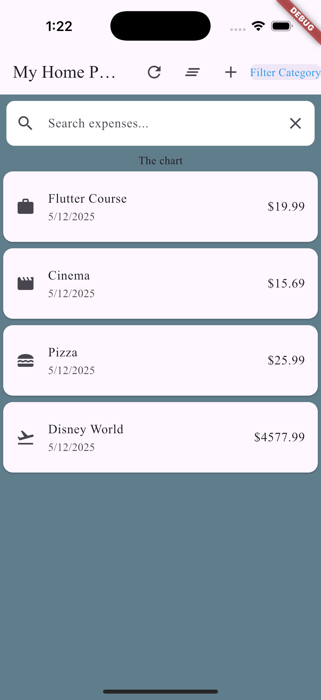
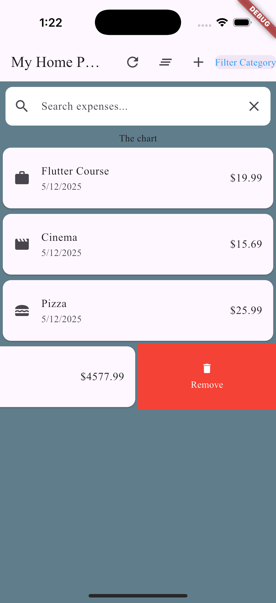
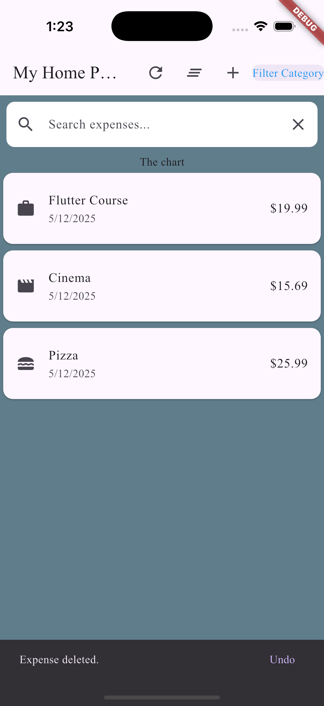
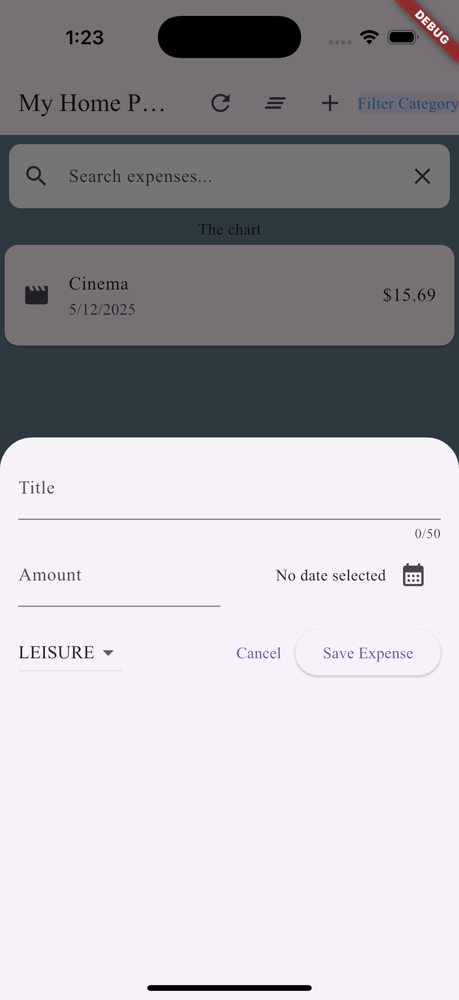

# app_expenses

Flutter application that Displays expenses, allowing you to add expenses.
List and Add, Remove.
Filtering can be done via Category and Search.
Clearing the Filter and Resetting to default data are also Icons.
Add has a Date Picker
Remove is a Slidable remove for a List.   Ability to undo Remove is in Snackbar.
Code shows example of Grid and List views for Reactive Displays.

## Getting Started

###  Expenses List

### Remove Expense

### SnackBar Undo Remove

### Category Filter

### Add Expense

